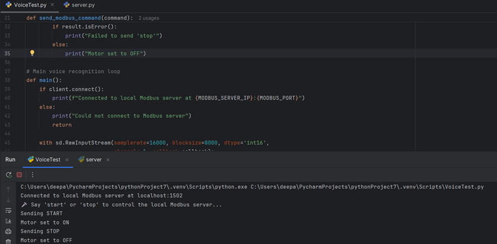
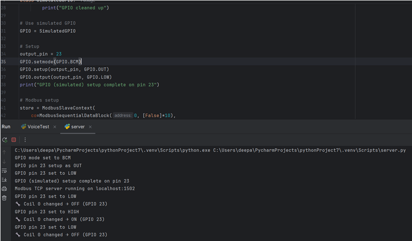
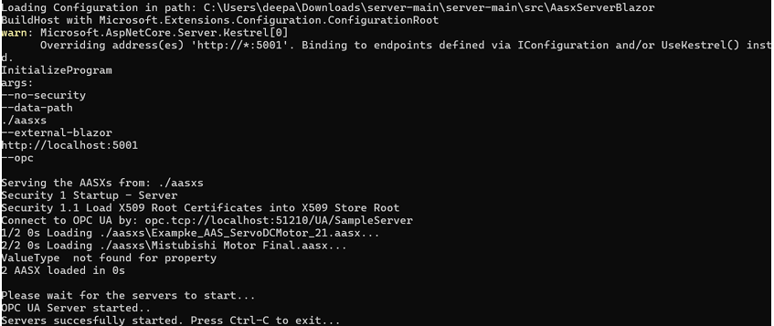
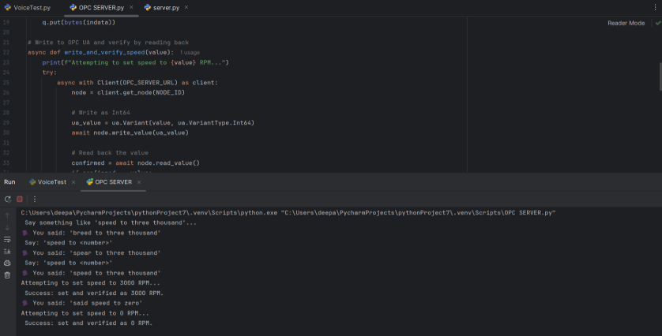

# Voice-Based Industrial Control System
### Using VOSK, Modbus TCP/IP, and OPC UA

This project demonstrates a **voice-controlled industrial automation system** that integrates **speech recognition (VOSK)** with **Modbus TCP/IP** and **OPC UA** communication protocols.  
It enables **hands-free machine control** by translating spoken commands (like “start”, “stop”, “set speed”) into industrial control actions.

---

##  Overview
As industries move toward **Industry 4.0**, human-machine interaction is evolving from traditional buttons and HMIs to **voice-driven interfaces**.  
This project explores how **open-source voice recognition** can be combined with **industrial communication protocols** to control physical and digital assets.

The system bridges the **voice layer** (IT) and **machine control layer** (OT) using a **laptop** as a voice-processing unit and a **Raspberry Pi** as the control device.

---

## Example Images of Work

Modbus TCP/IP Client Running with Voice Recoginition tool

Modbus Server Controlling the Output

AASX Blazor OPC UA Server Running

Voice Command Sent via OPCUA Client and updated AASX

##  Technologies Used
| Component | Technology |

| Speech Recognition | **VOSK** (offline open-source ASR model) |
| Communication | **Modbus TCP/IP**, **OPC UA** |
| Industrial Integration | **AASX Blaze Server** (Asset Administration Shell) |
| Hardware | **Laptop** (client), **Raspberry Pi (IONO)** (control unit) |
| Language | **Python 3.8+** |
| Libraries | `pymodbus`, `asyncua`, `vosk`, `socket`, `json` |

---

##  How It Works
1. The **VOSK recognizer** listens for specific voice commands:
   - “Start Motor”
   - “Stop Motor”
   - “Set Speed 3000”
2. The command is **converted to text** and mapped to a control action.
3. Based on the mode:
   - **Modbus TCP/IP:** Sends control signal to Raspberry Pi to toggle GPIO for motor ON/OFF.
   - **OPC UA:** Updates node values in the **Asset Administration Shell (AAS)** digital twin via Blaze Server.
4. The system logs each command and provides status confirmation.

